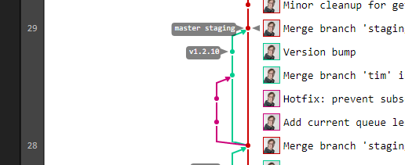

# gitlab-network-graph
An attempt to make the _excellent_ GitLab network graph portable.

## Why?

Because after you've seen GitLab's network graph, _GitHub's_ leaves a lot to be desired.

Plus, sometimes its nice to see a good graph _before_ you push to your remote. :smile:

## What?

This repository is pretty much a duplication of [GitLab's network graph JS](https://github.com/gitlabhq/gitlabhq/tree/v9.3.4/app/assets/javascripts/network) as of GitLab v9.3.4 (with some very minor modifications), using a stripped-down version of [GitLab's webpack config](https://github.com/gitlabhq/gitlabhq/blob/v9.3.4/config/webpack.config.js) as of the same version. GitLab's network graph in turn uses [Raphaël](http://dmitrybaranovskiy.github.io/raphael/).

Then, we've added some simple tools to locally generate suitably formatted JSON output of your git log.

## How?

Firstly, [install node.js](https://nodejs.org/en/download/current/) if you don't already have it. Then:

1. Clone this repository locally (into somewhere you can access through your local webserver).

   `git clone https://github.com/ChromatixAU/gitlab-network-graph.git`

2. `cd` into any _other_ repository you have - i.e. one that you want to get the network graph for!
3. Run `/path/to/gitlab-network-graph/scripts/network.sh`. This will take a little while the first time you run it.
    * Depending on your environment you may need to `chmod +x` this script before you can run it.
4. Open http://localhost/gitlab-network-graph in your browser (assuming that's where it's accessible from).

To condense steps 3 and 4 later on, you may want to add a git alias:

Run this once, replacing both the path you've cloned gitlab-network-graph to, and the relevant path to your local webserver:

    git config --global alias.network '!/path/to/gitlab-network-graph/scripts/network.sh && start chrome "http://localhost/gitlab-network-graph"'

Then, whenever you want to see the network graph pop up on your screen, from within the repo you want to see, just run:

    git network

_This tool has been tested in Git Bash on Windows 10 64 bit, with node.js v7.0.0, npm 3.10.8, perl v5.22.1 and Chrome 59. Your mileage may vary._

## TODO

* Tweak the parent 'space' detection to match how GitLab does it - we're not quite there yet (in progress on `space-detection` branch).
* See if it's possible to disable/work-around a caching issue that occasionally pops up - the data _should_ refresh from disk every time.
* See if it's possible to always show the log from the perspective of `master` at the first space - like GitLab does by default - even when another branch is ahead of master.
* Work out how to continue rendering on scroll a little earlier than it does now.
* Support the fancy tooltips like GitLab does.
* When displaying a ref twice, consider also displaying which one is the remote's.
* Maybe add to the output a small header/footer with a link to this repo or something.
* Bundle a node.js http server so that it doesn't need to rely on the user having a server running OR look at whether the loading can be modified to not use AJAX so that it can run directly off the local filesystem.
* Look at the possibility of making a hosted version of this that uses the GitHub API to pull commit lists from there, for _any_ repository.

## Contributing

Pull requests and issues are most welcome. Go forth!

## License

MIT. See [LICENSE](LICENSE).
